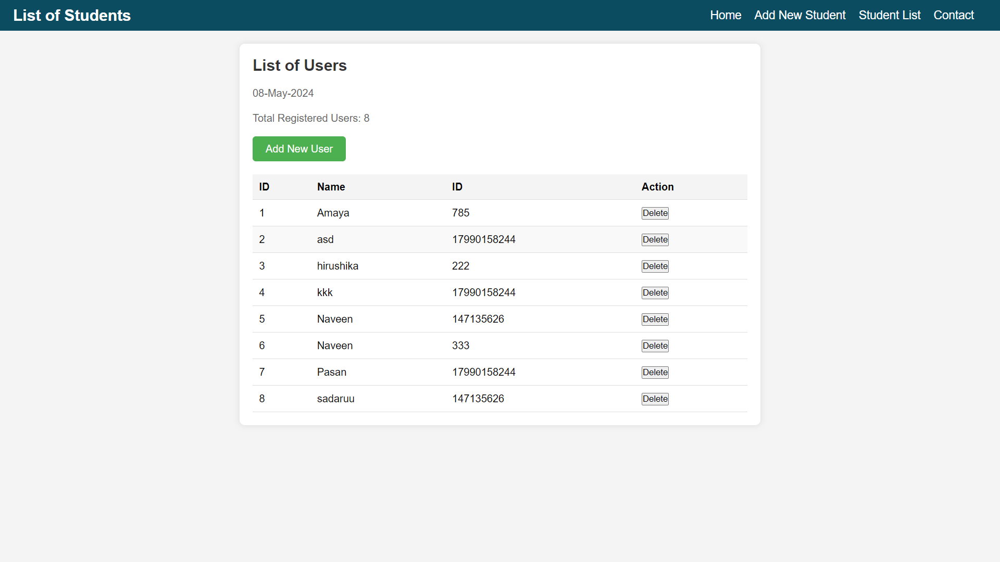
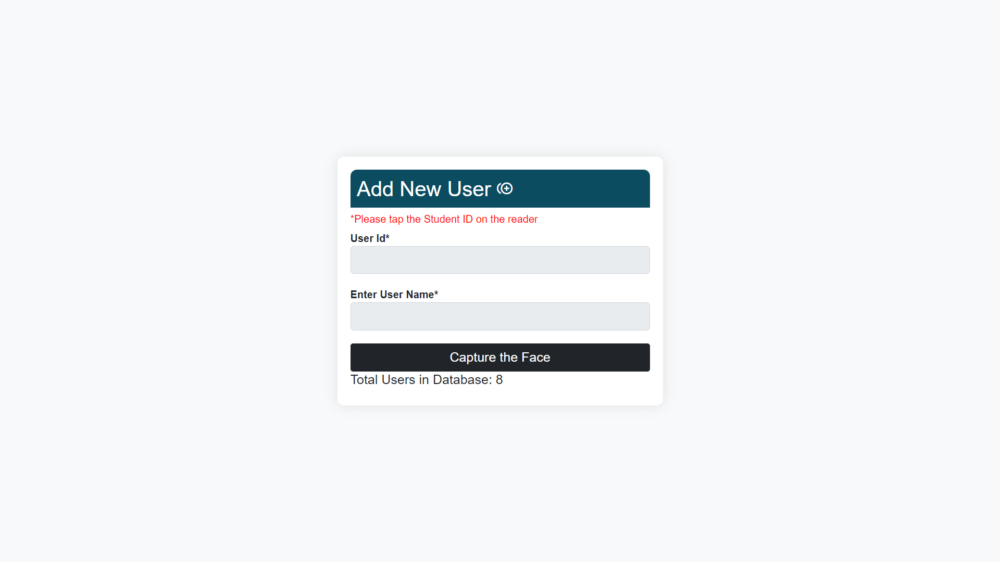

# face-recognition-based-attendance-system  

This user guide provides comprehensive instructions for installing, configuring, and operating the FacialX system, a sophisticated face recognition-based attendance system designed for educational institutions. The guide is structured to assist both technical staff and end-users in understanding and utilizing the system effectively.

## System Requirements

Before installation, ensure that the target system meets the following minimum specifications to ensure optimal performance and stability:

•	Operating System: Windows 10 or higher, MacOS 10.14 Mojave or higher, or a modern Linux distribution such as Ubuntu 20.04 LTS.

•	Processor: Intel Core i5 or higher, or equivalent AMD processor.

•	Memory: 8 GB RAM minimum.

•	Hard Disk: 100 GB of free space.

•	Camera: HD webcam with 720p resolution or better.

•	Internet: Broadband internet connection for initial setup and updates.

•	Software Dependencies: Python 3.8 or higher, PostgreSQL 12.0 or higher, latest version of Flask.

## Installation Process

1.	Software Installation:

Step 1: Install Python

•	Download Python 3.8 or higher from the official Python website.
•	Run the installer and ensure that Python is added to your system’s PATH.

Step 2: Install PostgreSQL

•	Download the latest version of PostgreSQL for your operating system.
•	Follow the installation wizard, and remember to note the database credentials as they will be needed later.

Step 3: Install Flask and Required Libraries

•	Open a command terminal and install Flask using pip:

        pip install Flask

•	Install additional required Python libraries:

        pip install flask_sqlalchemy psycopg2-binary face_recognition numpy opencv-python

2.	Database Setup:

Step 1: Create Database

•	Access the PostgreSQL command line tool and create a new database:

        CREATE DATABASE facialx;

Step 2: Configure the Application

•	Modify the database connection settings in your application’s configuration file to match the credentials and database name you’ve set.

3.	Deploy the Application:

•	Navigate to the directory of your Flask application via the command terminal.
•	Run the application:

        python app.py

•	Ensure the server starts without errors, indicating that all dependencies are correctly installed and configured.

## Usage Instructions

### For Administrators:

Dashboard Access:

•	Log in to the system using administrator credentials provided during the setup phase.
•	The administrator dashboard provides a comprehensive overview of attendance data, system logs, and user management options.

Adding Users:

•	Navigate to the ‘Users’ section.
•	Click on ‘Add New User’ and fill in the required details such as name, role, and credentials.
•	Submit the form to register a new user in the system.

Viewing Reports:

•	Access the ‘Reports’ section to view detailed attendance reports.
•	Use filters to refine report criteria by date, class, or individual user.

### For Teachers:

Taking Attendance:

•	Log into the system using teacher credentials.
•	Select the class for which attendance needs to be recorded.
•	The system automatically recognizes students’ faces and records attendance. Manual adjustments can be made if necessary.

Reviewing Attendance Records:

•	Navigate to the ‘Attendance Records’ section to review or modify attendance entries.
•	Corrections can be submitted for approval to ensure accuracy and accountability.

## System Maintenance and Support

Regular system maintenance is crucial for the smooth operation of FacialX. Scheduled backups, system updates, and periodic hardware checks are recommended. For technical support, contact the IT department or access the help section within the application for troubleshooting guides and contact information.

Github Link: https://github.com/NaveenTharak/FacialX.git

